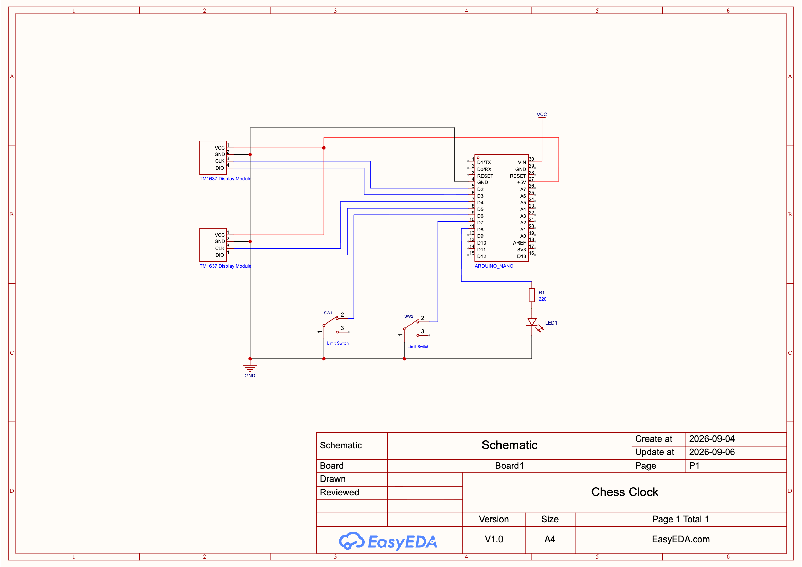

# Chess Timing Clock

A ConductorAI themed 3D-printed Arduino-based chess clock with independent time controls, time increment support, dual 7-Segment displays, and mechanical paddle buttons.

## Schematic

## Bill of Materials (BOM)

| Material | Count |
|---|---|
| CAD files are available in [Onshape](https://cad.onshape.com/documents/ef026658cd19dbbd06ef2f29/w/d300655bc5e5fb3e3e495900/e/ef8b9bfafebdc6279e713ce3?renderMode=0&uiState=6a94ef4f233901fb86f0c1bc) | N/A |
| Arduino | 1 |
| TM1637 4-Digit 7-Segment LED Display | 2 |
| Endstop limit switch | 2 |
| LED | 1 |
| Pen spring | 4 |
| M2x10 Bolt | 12 |
| M3x10 Bolt | 8 |
| M3 Washer | 4 |

## Assembly Instructions

*Printed in PLA on an Ender 3 V3 SE.*

Reference the BOM and the exploded assembly shown below.

**Note:** Button depression is dampened by standard pen springs. Cut 4 springs in half and place each half around an M2 guide bolt (between the button and housing).

**Note:** There are shallow, circular imprints underneath the clock housing. Place small amounts of hot glue in these areas to prevent the clock from sliding.

## How to Use

**Before**
1. Power on Arduino via USB cable
2. Long press (0.5s) to cycle time control for both players (display will alternate between time constraint and increment)
3. When ready Player 2 (Black) will perform a short press Player 1's (White) button to start their time

**During**
- Players exchange moves, firmly pressing down their button once the move is complete

**After**
1. If a player runs out of time, the timer will stop automatically
2. Clicking that player's button will reset the timer to the previously selected time constraint
