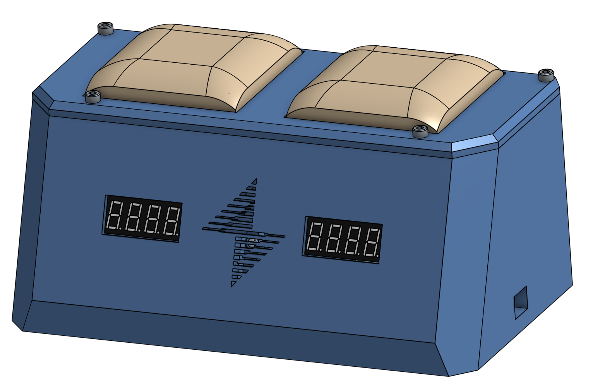
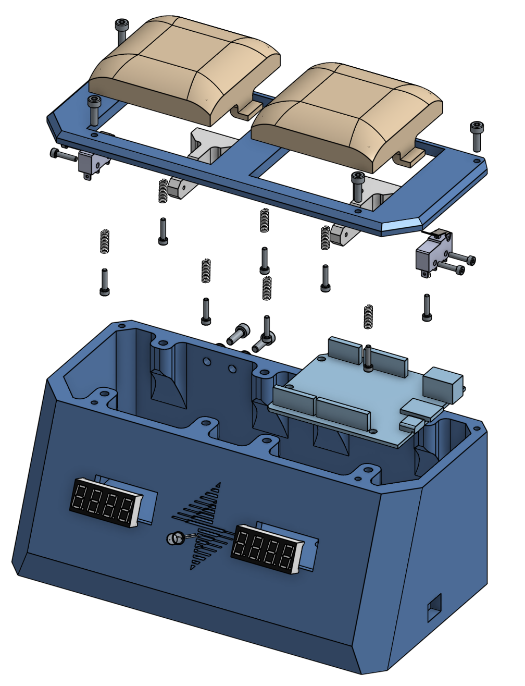

# Chess Timing Clock

## Schematic

## Bill of Materials (BOM)

| Material | Count |
|---|---|
| CAD files are available in [Onshape](https://cad.onshape.com/documents/ef026658cd19dbbd06ef2f29/w/d300655bc5e5fb3e3e495900/e/ef8b9bfafebdc6279e713ce3?renderMode=0&uiState=6a94ef4f233901fb86f0c1bc)   | N/A  |

## Assembly Instructions

Reference the BOM and the exploded assembly shown below

## How to Use

**Before**
1. Power on Arduino via USB cable
2. Long press (0.5s) to cycle time control for both players (display will alternate between time constraint and increment)
3. When ready Player 2 (Black) will perform a short press Player 1's (White) button to start their time

**During**
- Players exchange moves, firmly pressing down their button once the move is complete

**After**
1. If a player runs out of time, the timer will stop automatically
2. Clicking that player's button will reset the timer to the previously selected time constraint
